# DeepSee: Detecting benthic lifeforms in deep-sea environments

## Contributors

- [Ebbe H. Hartz](https://linkedin.com/in/ebbe-hartz) *(AkerBP)*
- [Karthik H. Iyer](https://linkedin.com/in/karthik-iyer-38a56b70) *(Bergwerk)*
- [Camilla Marnor](https://linkedin.com/in/camilla-marnor-17247988)*(Bergwerk)*
- [Daniel W. Schmid](https://linkedin.com/in/danischmid) *(Bergwerk)*

## Affiliations

This work is a collboration between [AkerBP](https://akerbp.com/en/) and [Bergwerk](https://www.bergwerk.com/).

## Introduction

The deep sea remains one of the least explored frontiers on Earth, with limited high-resolution data available on its biological diversity. Recent advances in technology have resulted in large amounts of high-resolution footage captured by remotely operated vehicles (ROVs). While this wealth of data holds immense potential for scientific discovery, the sheer volume makes manual annotation impractical. This is where machine learning (ML) can play a pivotal role, automating the annotation process and enabling more efficient analysis of these vast datasets. Our objective is to contribute to the emerging, high-resolution database on benthic life by leveraging ML to process and annotate the extensive video footage. This approach is not intended to replace biologists but to augment their capabilities, allowing them to focus on more complex analytical tasks. We present the *DeepSee* dataset, a comprehensive collection of annotated images from the Arctic Mid-Ocean Ridge, the Norwegian Sea, and the Greenland Sea. This dataset is designed to support the development of ML models capable of detecting and classifying benthic organisms. The *DeepSee* object detection model, trained on this dataset, is capable of processing vast amounts of footage quickly with high precision and recall. The model provides a valuable addition to the traditional workflow of manual annotation by significantly reducing the load on human annotators. By deploying such models, we aim to streamline the annotation process, making it easier for biologists to conduct their research and ultimately aiding in the informed decision-making regarding deep-sea resource management and protection.

## Dataset

The *DeepSee* dataset is largely constructed using frame grabs from videos captured by remotely operated vehicles (ROVs) during deep-sea surveys in the Arctic Mid-Ocean Ridge, the Norwegian Sea, and the Greenland Sea. The video material is provided, free of charge, by the [Norwegian Offshore Directorate](https://www.sodir.no). High-quality images, where instances of one or more classes are distinctly visible, are selected for the training dataset. Classes are chosen based on distinct morphospecies and groups of morphospecies that share a similar morphology. Additional non-biological classes (ROV parts) that occasionally occur in the images are also included to reduce false positives of biological classes. Note that class in this context is a ML-term, not to confused with the biological taxon class.  

<table>
  <tr>
    <td align="center" width="50%">
      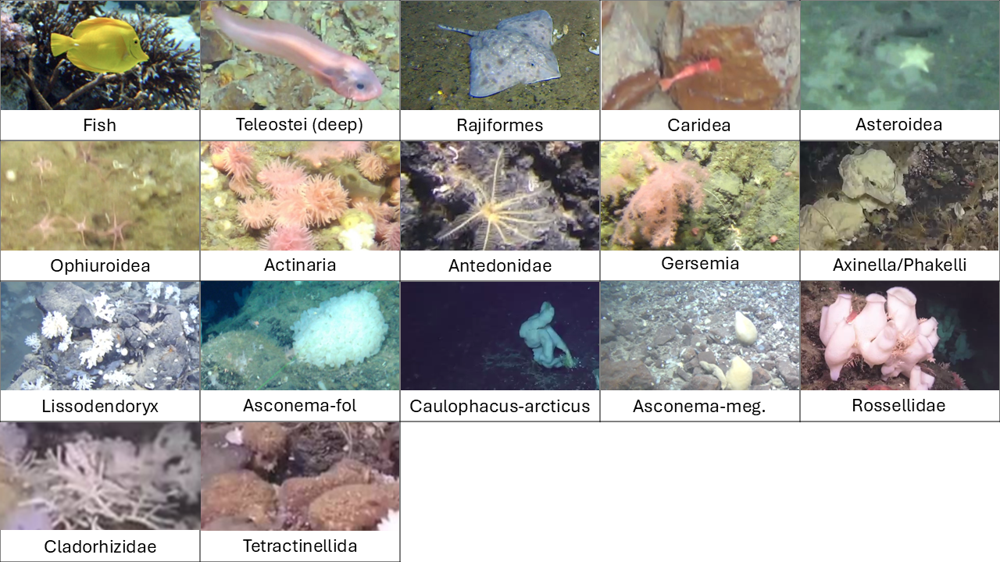
       
      <b>Classes in the DeepSee dataset</b>
    </td>
    <td align="center" width="50%">
      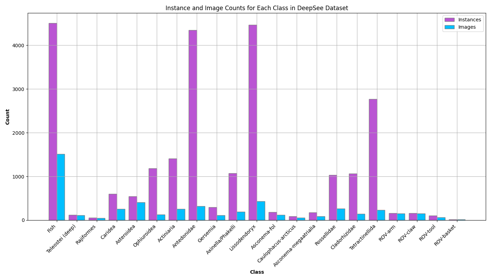
       
      <b>Instance and image count in the DeepSee dataset</b>
    </td>
  </tr>
</table>
 

## Model Performance

The *DeepSee* model is trained on 4 Tesla T4 GPUs. Inference time for a single image is ~60-120 ms. Inference on video frames is much faster and requires between 30 and 60 ms/frame.

<table>
  <tr>
    <td align="center" width="37%">
      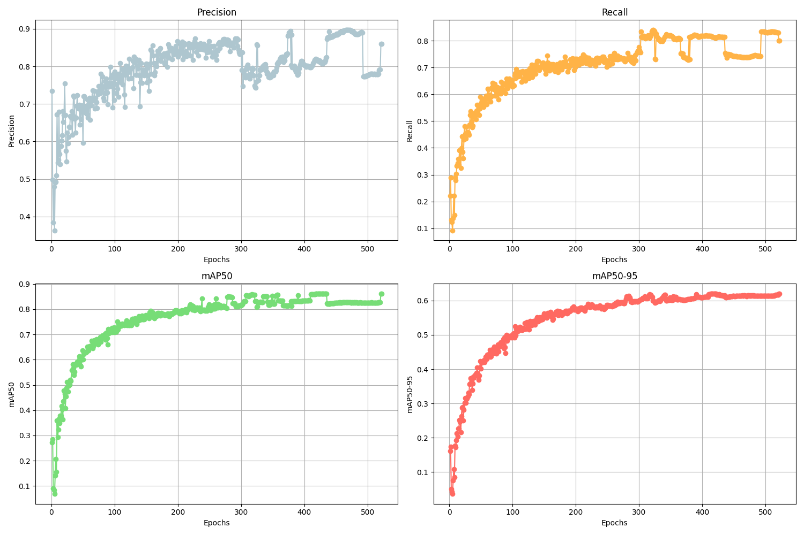
       
      <b>Training Metrics</b>
    </td>
    <td align="center" width="24%">
      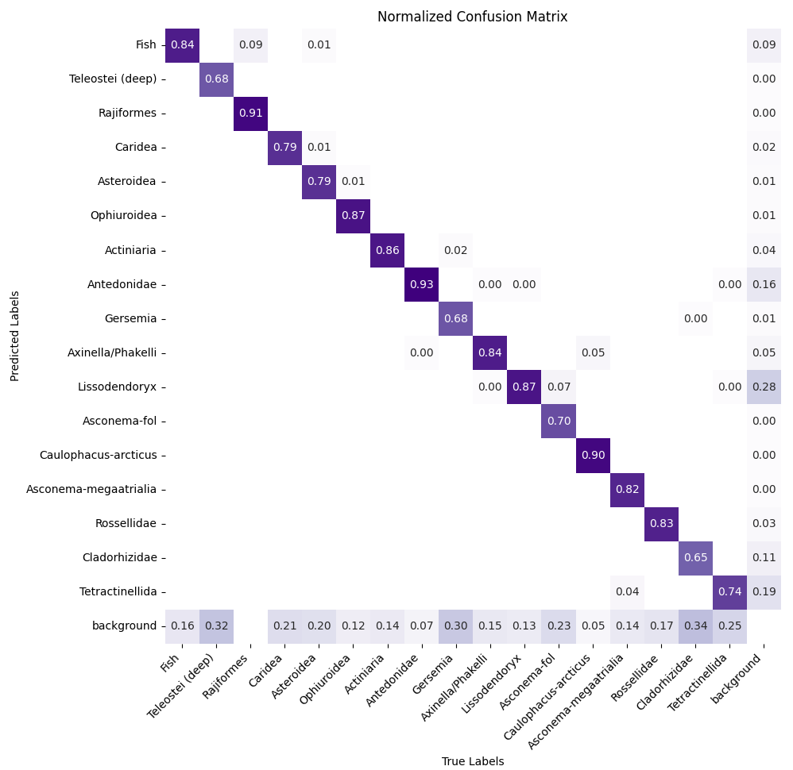
       
      <b>Confusion Matrix</b>
    </td>
    <td align="center" width="37%">
      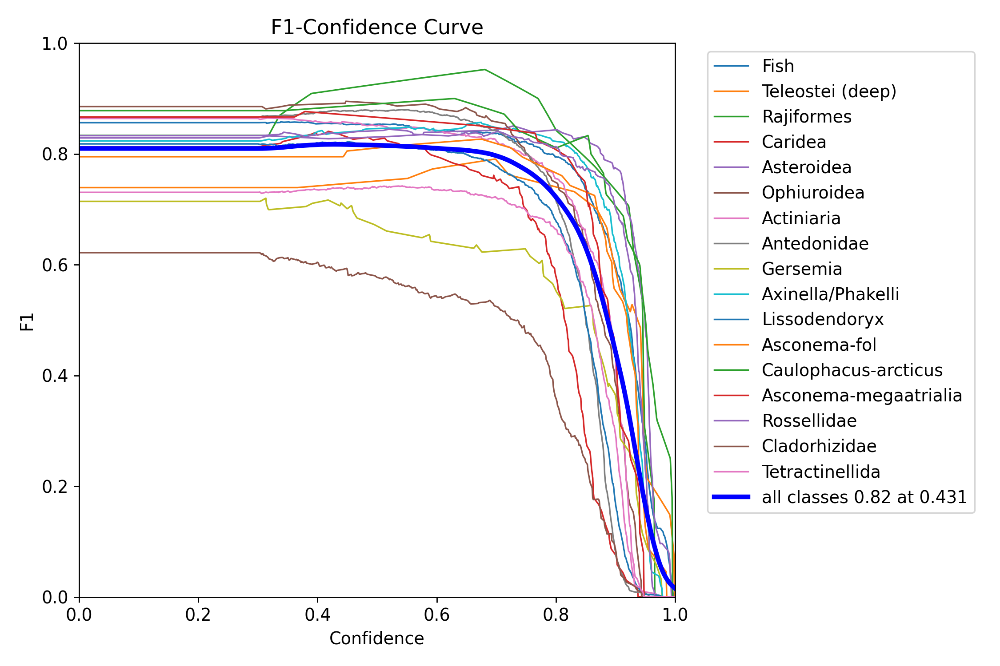
       
      <b>F1 Curve</b>
    </td>
  </tr>
</table>
 

## Results 

### Video Inference

Below we demonstrate inference performed on media released by the Norwegian Broadcasting Corporation (<a href="https://www.nrk.no/klima/xl/ned-i-dypet-1.16472301">NRK release</a>). Note that this video is not part of the training dataset.

### DeepSee with Photogrammetry     

Usually, detection is carried out on video frames that only include the general location of the ROV. In areas of particular interest where high quality videos are available, frames can be stitched together into orthomosaics using photogrammetry. Object detection using the *DeepSee* model on such orthomosaics allows for pinpointing the location of individual organisms on the sea floor. The image below shows the exact coordinates of detected lifeforms using this technique.

### Benthic Lifeform Maps

The results obtained from the *DeepSee* model can be used to generate high resolution (down to the meter scale) maps of benthic life in the deep ocean. Due to general sparseness of such data, maps are usually created with a granularity of hundreds to tens of thousands of square kiolometers (e.g. [report by the Institue of Marine Research, Norway](https://www.hi.no/hi/nettrapporter/rapport-fra-havforskningen-en-2024-5), [recent mapping paper by Ramirez-Llodra et al., 2024](https://online.ucpress.edu/elementa/article/12/1/00140/203384/The-emerging-picture-of-a-diverse-deep-Arctic)) which may result in an incomplete or inaccurate assessment of the region of interest. We have created hex maps using our results going from a 50,000 km² hex grid down to a 1 km² grid to illustrate how changing granularity changes perceived distribution and can greatly influence decision making when it comes to deepsea resource management. The hex grid images display an overview grid with 50,000 km² down to 100 km² hexes next to a zoomed grid that goes down to 1 km² hexes for number of organisms (abundance) and the number of different species (richness) detected in a hex. Note that the hex grids are limited to 1 km² simply for illustration purposes and not result/data constrained. Interactive htmls of the [abundance](/data/240930/html/240930_deepsee_abundance.html) and [species richness](/data/240930/html/240930_deepsee_richness.html) hex grids can be accessed by the provided links. **Note that the html raw code needs to be downloaded and saved as an html file before viewing it in a browser.**

<table>
  <tr>
    <td align="center" width="50%">
      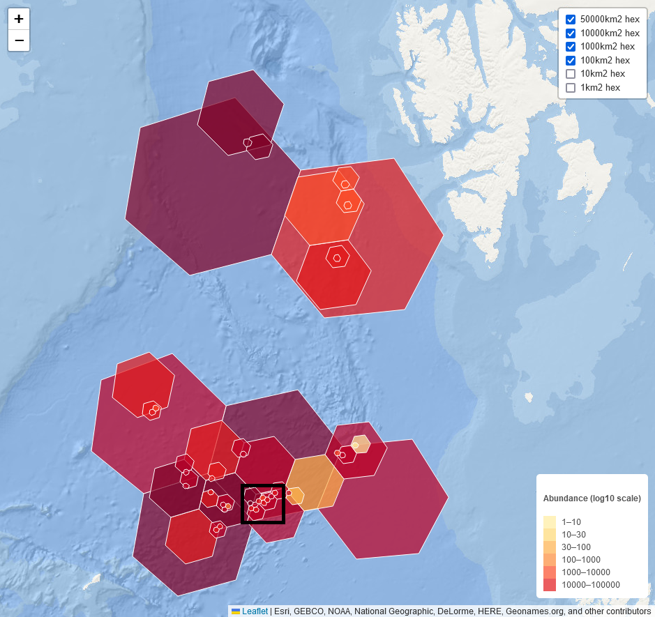
       
      <b>Overview hex grid showing lifeform abundance detected by the DeepSee model. The black rectangle shows the coverage of the adjacent image.</b>
    </td>
    <td align="center" width="50%">
      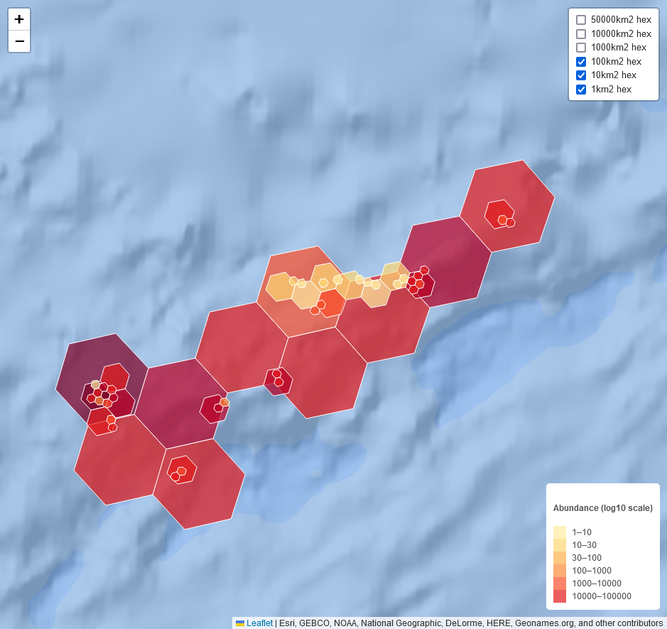
       
      <b>Zoomed hex grid showing lifeform abundance detected by the DeepSee model</b>
    </td>
  </tr>
</table>
 

<table>
  <tr>
    <td align="center" width="50%">
      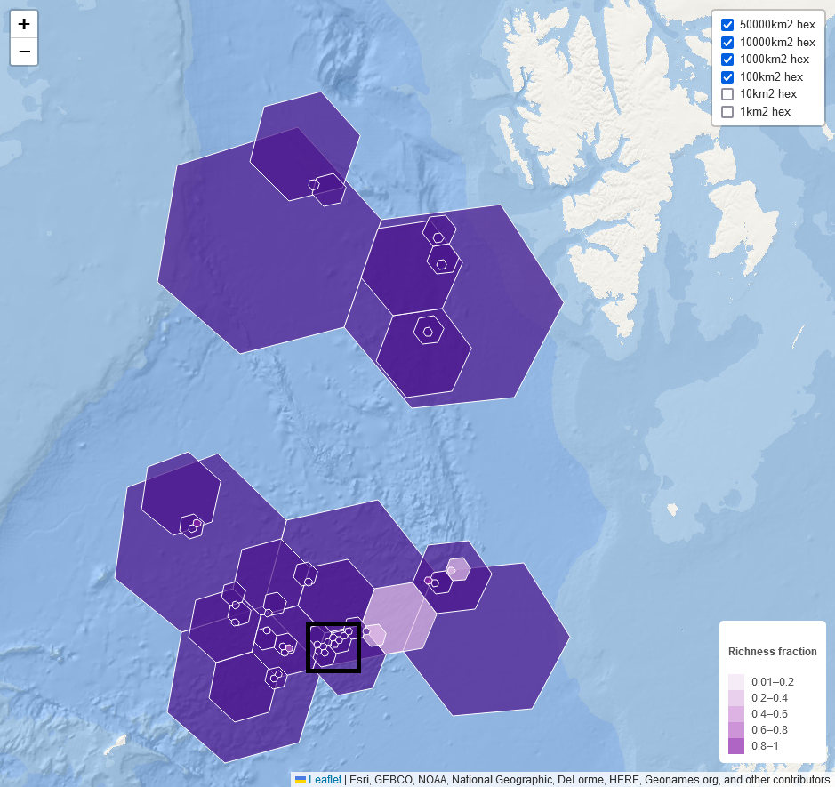
       
      <b>Overview hex grid showing species richness detected by the DeepSee model. The total number of detectable species is 17. The black rectangle shows the coverage of the adjacent image.</b>
    </td>
    <td align="center" width="50%">
      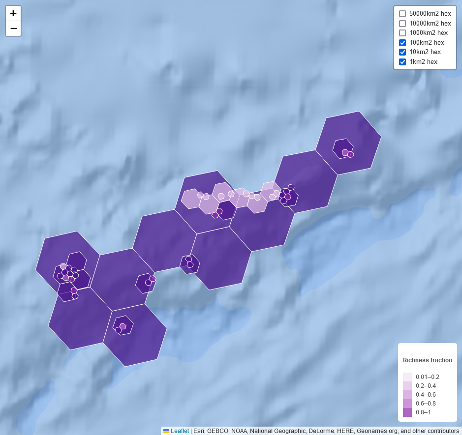
       
      <b>Zoomed hex grid showing species richness detected by the DeepSee model. The total number of detectable species is 17.</b>
    </td>
  </tr>
</table>
 

### Comparison with Other Data

*DeepSee* has mapped approximately 500,000 individual life forms in the Norwegian Proposed Opening Area for Mineral Exploration. Below, we compare this data to [GBIF](https://gbif.org) and [OBIS](https://obis.org) data for the same region.

<table>
  <tr>
    <td align="center" width="50%">
      
       
      <b>Count comparison between DeepSee, GBIF and OBIS in the Norwegian Proposed Opening Area for Mineral Exploration.</b>
    </td>
    <td align="center" width="50%">
      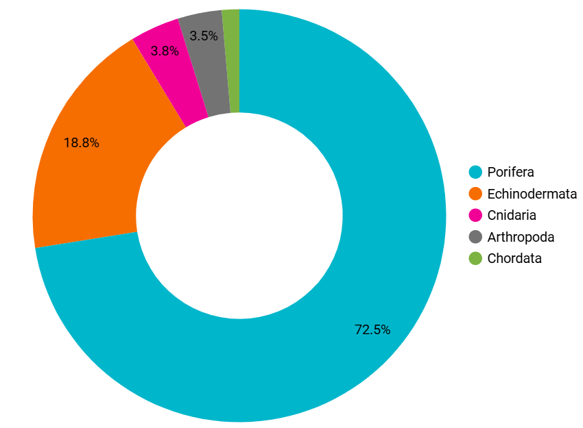
       
      <b>Relative proportions of phyla detected by DeepSee.</b>
    </td>
  </tr>
  <tr>
    <td align="center" width="50%">
      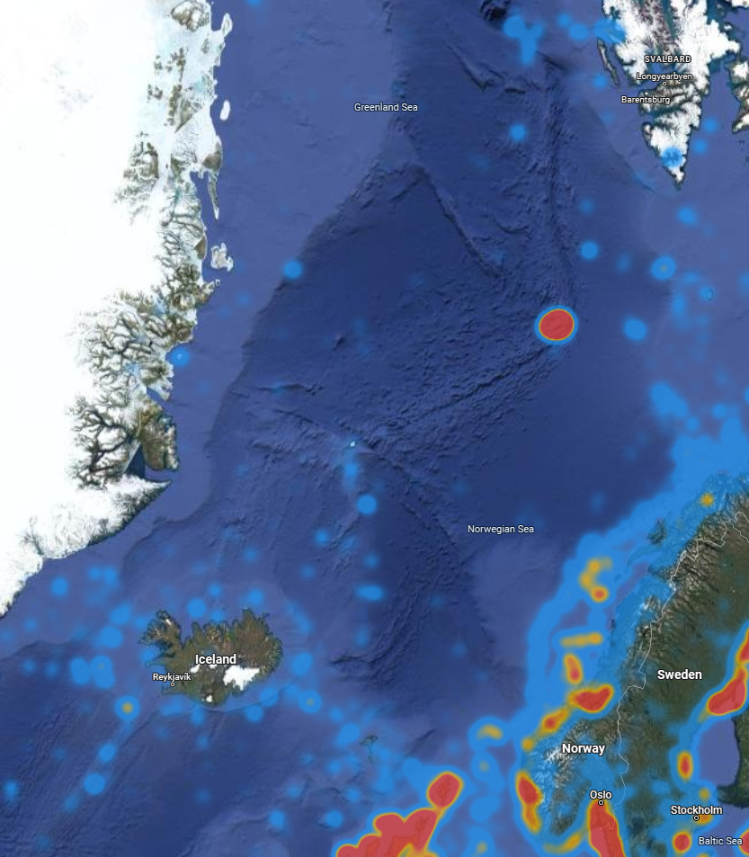
       
      <b>Heatmap showing Porifera records in the GBIF database.</b>
    </td>
    <td align="center" width="50%">
      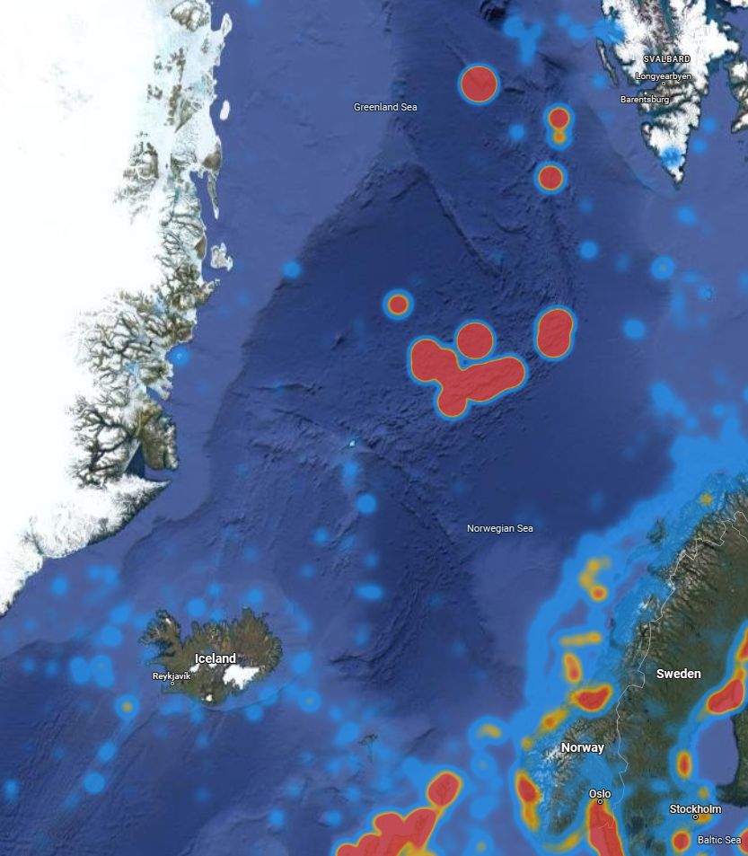
       
      <b>Heatmap showing Porifera records in the GBIF database and detections using DeepSee.</b>
    </td>
  </tr>
</table>

## Conclusion

By deploying machine learning models like *DeepSee*, we aim to streamline the annotation process, enhancing biologists' capabilities in conducting research and supporting informed decision-making regarding deep-sea resource management and protection.

